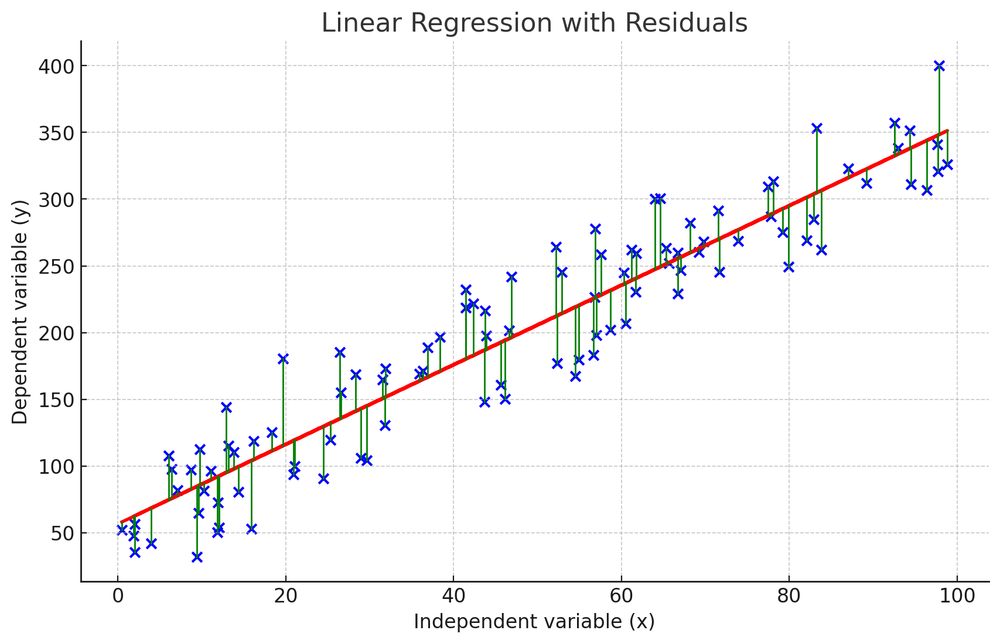

# AIH2024-S1_Linear_Regression_in_Healthcare
### AIH2024-S1: Predicting Diabetes Progression through Linear Regression in Python 
**Offered in the Class of Artificial Intelligence, March 13, 2024 | Faculty of New Sciences and Technologies, University of Tehran**

<div align="center">

</div>


# Intruductions
Linear regression is a powerful statistical technique used to model the relationship between a dependent variable (target) and one or more independent variables (features). It's widely used in various fields, including healthcare, economics, and social sciences, to make predictions and infer relationships between variables. The overall idea is quite straightforward: linear regression attempts to model the relationship between two (simple linear regression) or more (multiple linear regression) features or variables by fitting a linear equation to observed data. At its core, linear regression involves plotting a line through a set of data points in such a way that it minimizes the distance between each point and the line itself. This line can then be used to predict the value of a dependent variable Y based on the value(s) of one or more independent variables X. The straight line equation is:  
$`Y = \beta_0 + \beta_1X_1 + \beta_2X_2 + ... + \beta_nX_n + \epsilon`$

Where:
- Y is the dependent variable (target).
- X1, X2, ..., Xn are the independent variables (features).
- β0 is the intercept term.
- β1, β2, ..., βn are the coefficients representing the impact of each independent variable on the dependent variable.
- ϵ is the error term, representing the difference between the observed and predicted values.

<div align="center">

</div>

The goal of linear regression is to estimate the coefficients (β) that minimize the sum of squared differences between the observed and predicted values of the dependent variable. This value is a cost function value referred to as **Mean Squared Error (MSE)**:
<p align="center">
$MSE = \frac{1}{n} \sum (y_i - \hat{y}_i)^2$  
</p>

The squared term in the MSE makes it differentiable, facilitating mathematical treatment, especially for optimization using gradient descent. We typically use optimization techniques such as gradient descent to find the values of the coefficients (βs) that minimize the MSE. Linear regression aims to find the best-fitting line through a set of data points in a way that minimizes the distance between the data points and the line itself. The best-fitting line, also known as the regression line, is the line that minimizes the sum of the squared differences **(residuals)** between the observed values (data points) and the values predicted by the linear model. The algorithm calculates the distance (residuals) between the actual data points and the predicted points on the line. The best-fit line will be the one where the sum of the squared residuals is the minimum (Least Squares Method).

<div align="center">

</div>

Imagine you want to predict a patient's blood pressure, which is the dependent variable. You might consider age and weight as independent variables because you hypothesize that these factors could influence blood pressure. In simple linear regression, you would predict blood pressure from just one of these variables (say, age). The model would help you understand how blood pressure varies with age. If you use both age and weight, you'd move to multiple linear regression, allowing you to predict blood pressure based on a combination of both factors. Linear regression involves finding the "best fit" line through the data points. In simple linear regression, "best fit" means that the sum of the squared differences between the observed values and the values predicted by the model is as small as possible, a method known as least squares.

<div align="center">

</div>

# Python Code
### Dataset Description
In this part of the lecture, we want to predict the quantitative measure of diabetes progression one year after the baseline using the linear regression model. The dataset is an open-source diabetes dataset available on the website of [North Carolina State University](https://www4.stat.ncsu.edu/~boos/var.select/diabetes.tab.txt). 
This dataset consists of several columns representing different medical measurements:
- Number of Instances: 442
- Number of Attributes: The first 10 columns are numeric predictive values:
- AGE: Age in years
- SEX: Biological sex (encoded as 1 for male and 2 for female)
- BMI: Body mass index
- BP: Average blood pressure
- S1, S2, S3, S4, S5, S6: Various blood serum measurements
- Target: Column 11 is a quantitative measure of disease progression one year after baseline
- Y: Quantitative measure of diabetes progression one year after the baseline

More details: http://www4.stat.ncsu.edu/~boos/var.select/diabetes.html

### Make Data Ready
### - Load the data

```python
# Load the diabetes dataset
df = pd.read_csv("https://www4.stat.ncsu.edu/~boos/var.select/diabetes.tab.txt",sep="\t")
df.head()
```


